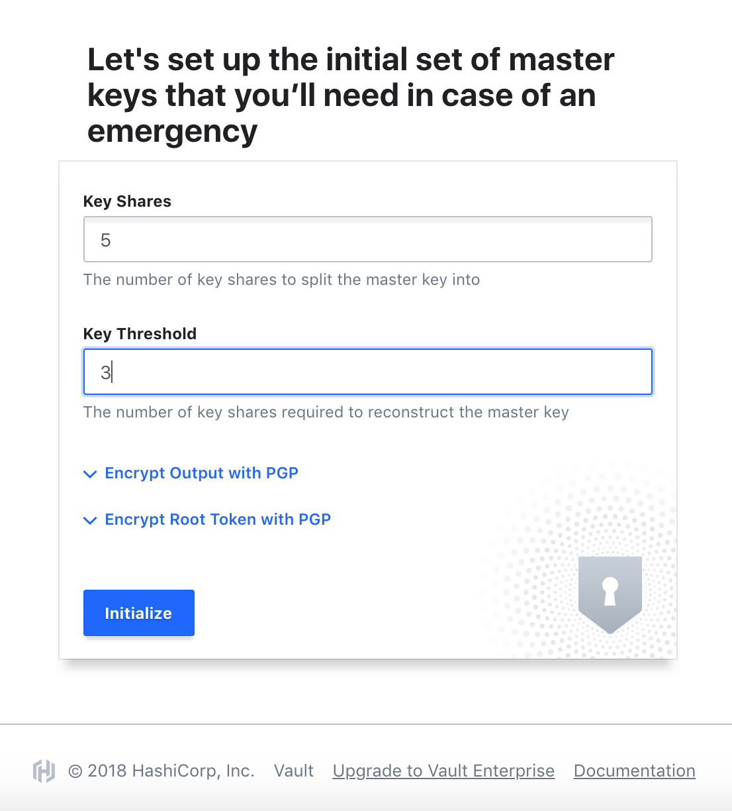
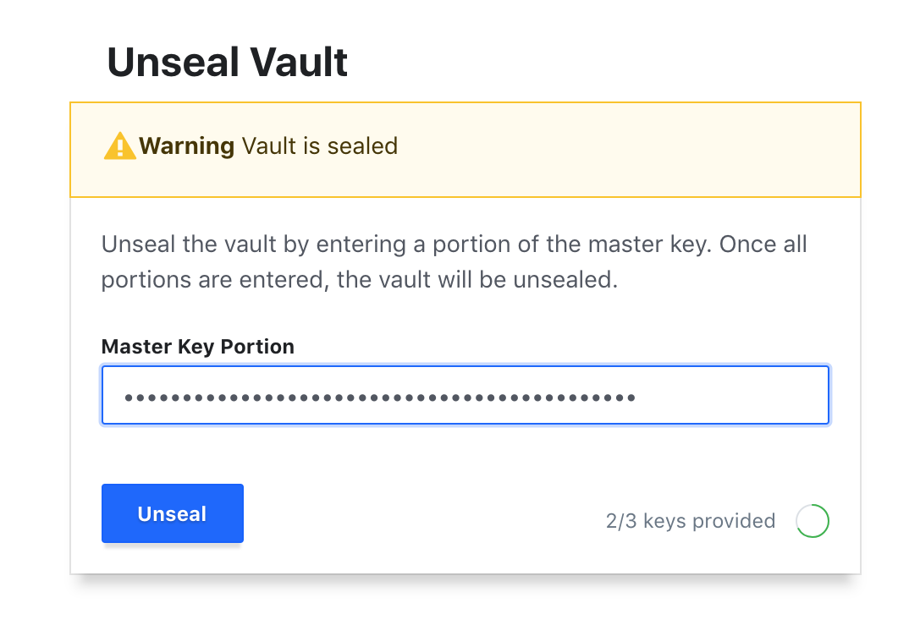
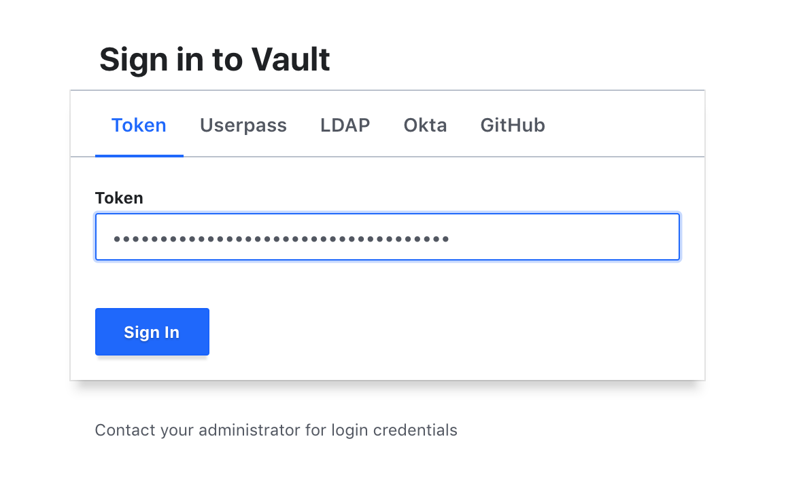
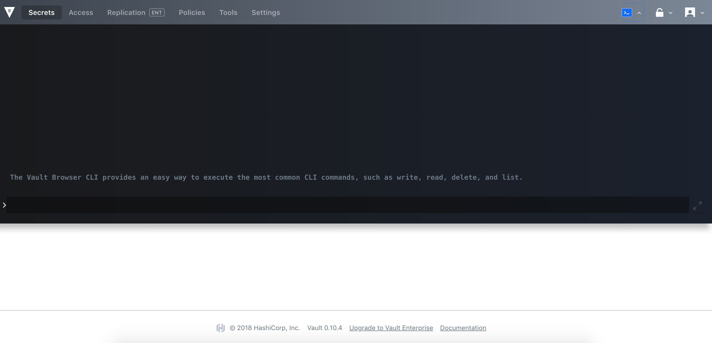
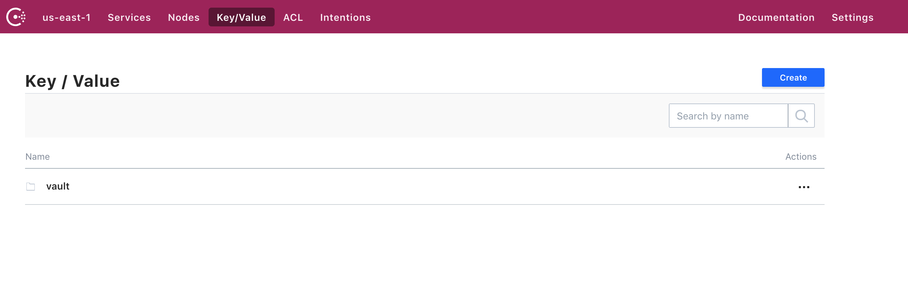
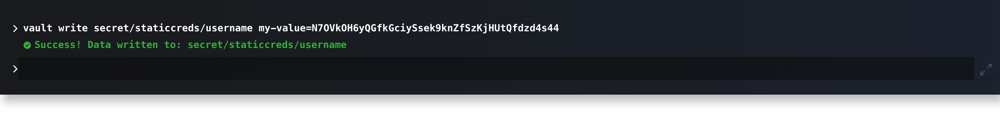
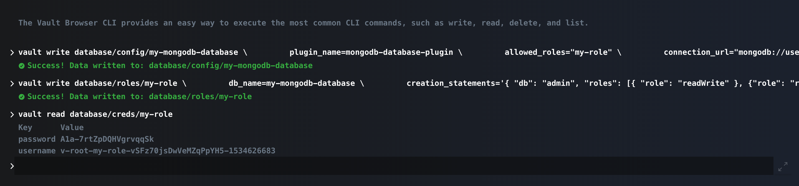

# vault-consul-swarm-cluster

### Prerequisite:
1. Docker
2. Docker Swarm

### Enable Docker Swarm locally
```
docker swarm init
```

### List Docker Swarm Node
```
docker node ls
```

### Deploy Stack
```
env $(cat .env | grep ^[A-Z] | xargs) docker stack deploy -c stack.yml devops
```

### Remove Stack
```
docker stack rm devops
```

### List Docker Services
```
docker service ls
```

### Deploy using Docker-compose
#### Deploy
```
docker-compose up -d
```

#### Terminate
```
docker-compose down
```


### Access Vault UI
```
open http://localhost:8200
```






### Access Consul UI
```
open http://localhost:8500
```




### Static credential


### Dynamic credential
